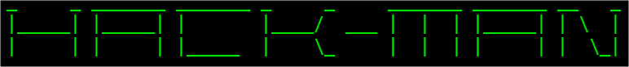
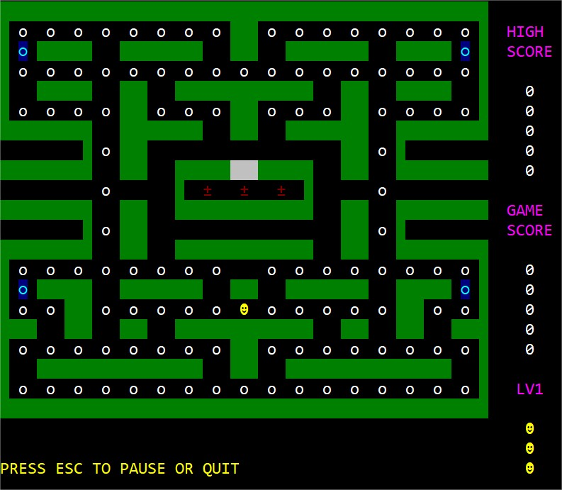

# 

> Terminal-based Pac-Man like game

<br/>

### **[Download for Windows](https://github.com/jamiegluk/hackman/releases/latest)**

<br/>

See the [README.md](doc/README.md) file in the download for further information.

---

## IMPORTANT

**This project's code and content is old, from 2012; do not view this as an example of my current work.**

## About

This is an old project.

- Created in 2012
- Using Dev Pascal (with Freepascal compiler)
- In High School
- As a Scottish Advanced Higher Computing final project.

We had to create some command line based game. The teacher expected a very basic game like Hangman. She said:

> You won't manage to create anything as advanced as Pac-Man

So I did.



## Building From Source

You need:

**Windows only!**

[Free Pascal](https://www.freepascal.org/) / `choco install freepascal`

Execute:

```
build.bat
```

The output can be found at:

```
dist/hackman/hackman.exe
```

### Alternatively

Download and run the IDE I originally used to create this:

[Dev Pascal](https://www.bloodshed.net/Dev-Pascal)

Then:

1. Open _src/create-highscores-file/createHighscoresFile.pas_
2. Click the green tick (Compile project).
3. Open _src/hackman/hackman.pas_
4. Click the green tick (Compile project).
5. Run `postbuild.bat`

## Copyright & Licensing

Created in an education environment.

Licensed for use under the GNU General Public License v3.  
See [LICENSE](LICENSE).

Based upon original concept:  
Pac-Man - © Copyright Namco 1980.
